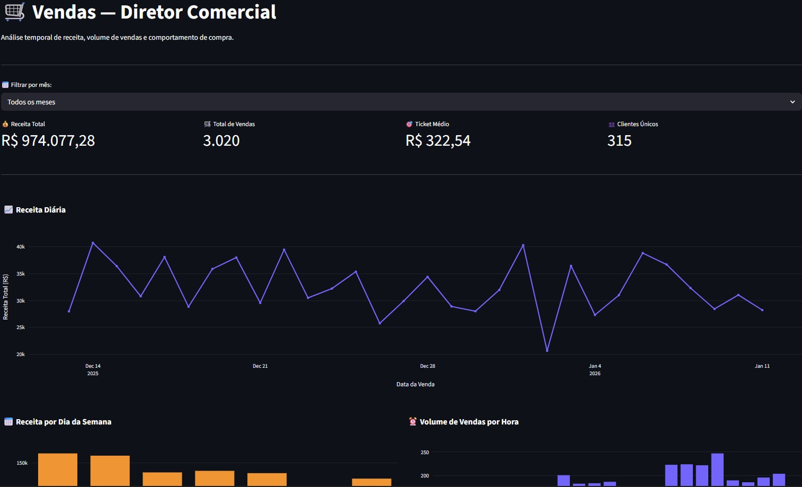
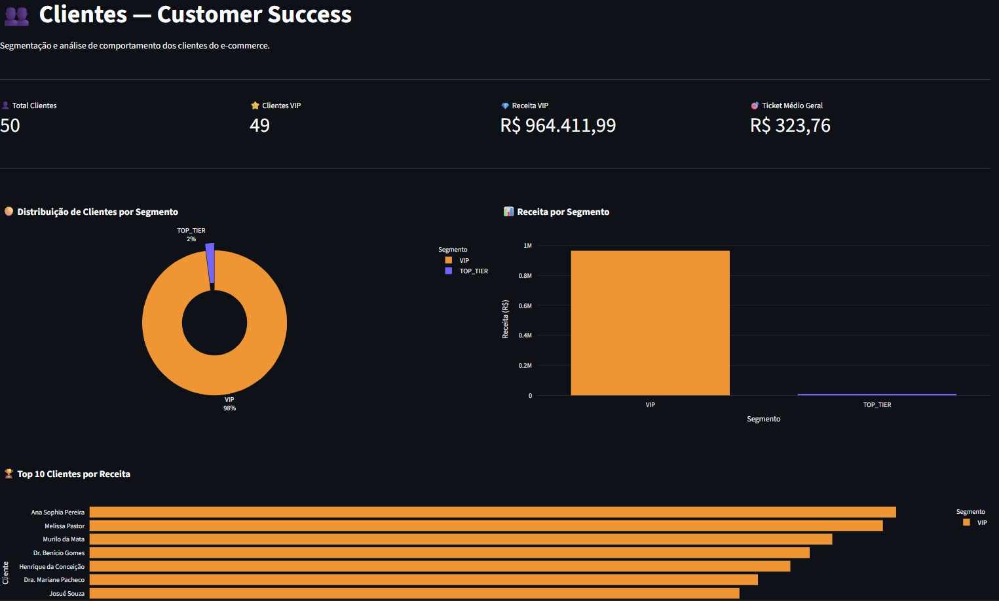
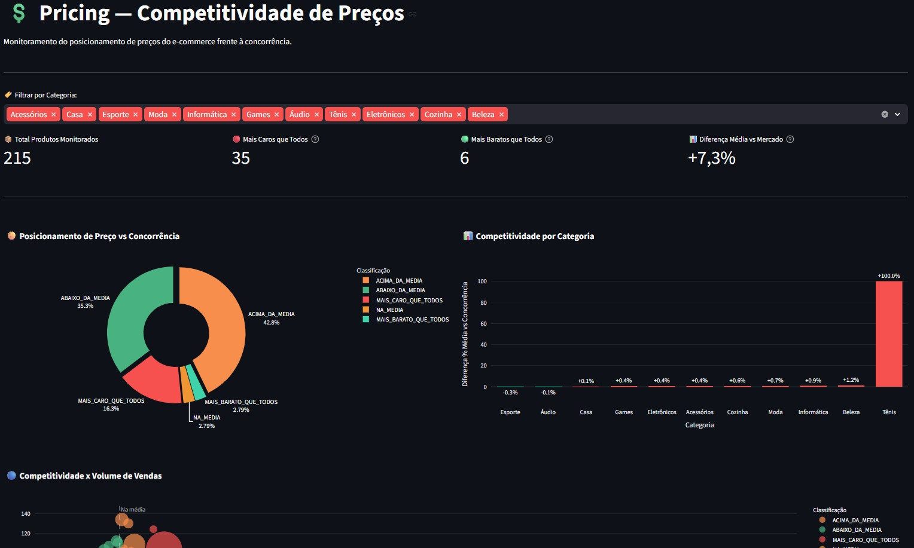

# 📊 E-commerce Analytics Dashboard

Dashboard executivo para análise de performance de um e-commerce, construído sobre uma **arquitetura Medalhão completa** (Bronze → Silver → Gold) com dbt e Supabase.

O projeto vai além de um dashboard: ele demonstra um **pipeline de dados de ponta a ponta** — da ingestão e modelagem até o consumo visual por diretores de negócio.

## 📌 Problema de Negócio

Diretores de Comercial, Customer Success e Pricing dependiam de planilhas manuais e relatórios demorados para acompanhar KPIs.

Este projeto centraliza métricas críticas em um único dashboard atualizado em tempo real, eliminando a dependência de processos manuais e permitindo decisões orientadas por dados.

## ✨ Principais Funcionalidades

- Pipeline completo: ingestão → transformação (dbt) → visualização (Streamlit)
- Arquitetura Medalhão com 11 modelos dbt (4 Bronze + 4 Silver + 3 Gold)
- 3 Data Marts Gold independentes, um por área de negócio
- KPIs em tempo real via PostgreSQL/Supabase
- Filtros dinâmicos por período e categoria
- Visualizações interativas com Plotly
- Arquitetura modular: cada página é um módulo independente

## 🏗️ Arquitetura de Dados — O Coração do Projeto

A parte mais relevante deste projeto é a **engenharia de dados por trás do dashboard**.

```
Dados Brutos (4 tabelas no PostgreSQL)
        │
        ▼
┌─────────────────────────────────────┐
│  CAMADA BRONZE  (4 modelos — views) │
│  Cópia fiel das tabelas originais   │
│  Sem transformações                 │
│  Serve como contrato do dado bruto  │
└──────────────┬──────────────────────┘
               │
               ▼
┌──────────────────────────────────────────────┐
│  CAMADA SILVER  (4 modelos — tables)         │
│  Dados limpos + colunas calculadas           │
│  Ex: receita_total, faixa_preco,             │
│      data_venda_date, dia_semana_nome        │
│  Sem JOINs — uma Silver por Bronze           │
└──────────────┬───────────────────────────────┘
               │
               ▼
┌──────────────────────────────────────────────────────┐
│  CAMADA GOLD  (3 Data Marts — tables)                │
│  Perguntas de negócio respondidas com SQL            │
│                                                      │
│  gold_sales    → vendas_temporais                    │
│  gold_cs       → clientes_segmentacao (VIP/TOP/REG)  │
│  gold_pricing  → precos_competitividade              │
└──────────────┬───────────────────────────────────────┘
               │
               ▼
    Streamlit Dashboard (app.py)
    ├── Vendas    → Diretor Comercial
    ├── Clientes  → Diretora de Customer Success
    └── Pricing   → Diretor de Pricing
```

### Por que Arquitetura Medalhão?

- **Bronze** garante rastreabilidade — sempre é possível voltar ao dado original
- **Silver** isola a limpeza da análise — dados consistentes para todas as camadas acima
- **Gold** responde perguntas de negócio específicas — cada Data Mart serve um stakeholder

## 📸 Screenshots

### Vendas — Diretor Comercial


### Clientes — Customer Success


### Pricing — Competitividade de Preços


## 🛠️ Tecnologias

| Tecnologia | Uso |
|---|---|
| Python 3.11 | Linguagem principal |
| dbt-postgres | Modelagem e transformação de dados (11 modelos) |
| Streamlit | Framework do dashboard |
| Plotly | Gráficos interativos |
| Pandas | Manipulação de dados |
| psycopg2 | Conexão com PostgreSQL |
| Supabase | Banco de dados PostgreSQL na nuvem |
| uv | Gerenciamento de ambiente e dependências |

## 📁 Estrutura do Projeto

```
projeto-ecommerce-dashboard/
│
├── Ecommerce/                      # Projeto dbt
│   ├── models/
│   │   ├── _sources.yml            # Contrato das fontes de dados
│   │   ├── bronze/                 # 4 modelos (views — sem transformação)
│   │   │   ├── bronze_vendas.sql
│   │   │   ├── bronze_clientes.sql
│   │   │   ├── bronze_produtos.sql
│   │   │   └── bronze_preco_competidores.sql
│   │   ├── silver/                 # 4 modelos (tables — dados calculados)
│   │   │   ├── silver_vendas.sql
│   │   │   ├── silver_clientes.sql
│   │   │   ├── silver_produtos.sql
│   │   │   └── silver_preco_competidores.sql
│   │   └── gold/                   # 3 Data Marts (tables — KPIs)
│   │       ├── sales/
│   │       │   └── vendas_temporais.sql
│   │       ├── customer_success/
│   │       │   └── clientes_segmentacao.sql
│   │       └── pricing/
│   │           └── precos_competitividade.sql
│   └── dbt_project.yml
│
├── case-01-dashboard/              # Aplicação Streamlit
│   ├── pages_modules/
│   │   ├── vendas.py               # Página Comercial
│   │   ├── clientes.py             # Página Customer Success
│   │   └── pricing.py             # Página Pricing
│   ├── utils/
│   │   ├── connection.py           # Conexão reutilizável com Supabase
│   │   └── formatting.py          # Formatação de valores em R$
│   ├── app.py                      # Ponto de entrada + roteamento
│   ├── requirements.txt
│   └── .env.example
│
├── pyproject.toml
└── README.md
```

## 📊 O que cada página mostra

### 1. Vendas (Diretor Comercial)
Fonte: `public_gold_sales.vendas_temporais`
- KPIs: Receita Total, Total de Vendas, Ticket Médio, Clientes Únicos
- Receita Diária (linha temporal)
- Receita por Dia da Semana
- Volume de Vendas por Hora do Dia
- Filtro por mês

### 2. Clientes (Diretora de Customer Success)
Fonte: `public_gold_cs.clientes_segmentacao`
- KPIs: Total Clientes, Clientes VIP, Receita VIP, Ticket Médio Geral
- Distribuição por Segmento: VIP / TOP_TIER / REGULAR
- Top 10 Clientes por Receita
- Clientes por Estado
- Tabela detalhada com filtro por segmento

### 3. Pricing (Diretor de Pricing)
Fonte: `public_gold_pricing.precos_competitividade`
- KPIs: Produtos Monitorados, Mais Caros que Todos, Diferença Média vs Mercado
- Posicionamento de Preço vs Concorrência
- Competitividade por Categoria
- Scatter: Preço vs Volume de Vendas
- Tabela de alertas: produtos críticos (MAIS_CARO_QUE_TODOS)
- Filtro por categoria

## 🚀 Como Executar

### Pré-requisitos
- Python 3.11+
- Conta no Supabase com os Data Marts Gold criados
- uv instalado (`pip install uv`)

### Instalação

```bash
git clone https://github.com/Jpmelof2/projeto-ecommerce-dashboard.git
cd projeto-ecommerce-dashboard
uv sync
```

### Configurar credenciais

```bash
cd case-01-dashboard
cp .env.example .env
# Edite o .env com suas credenciais do Supabase
```

```env
SUPABASE_HOST=seu-host.supabase.com
SUPABASE_PORT=5432
SUPABASE_DB=postgres
SUPABASE_USER=postgres.seu-usuario
SUPABASE_PASSWORD=sua-senha
```

### Rodar o dashboard

```bash
uv run streamlit run app.py
```

Acesse em: `http://localhost:8501`

### Rodar o pipeline dbt (opcional)

```bash
cd Ecommerce
uv run dbt run          # Executa todos os 11 modelos
uv run dbt docs serve   # Abre documentação no navegador
```

## 💡 O que Aprendi

- Arquitetura Medalhão e suas camadas (Bronze / Silver / Gold) com dbt
- Diferença entre materialização como view e table no dbt
- Modelagem analítica: como transformar dados brutos em métricas de negócio
- Boas práticas de SQL para analytics: CTEs, window functions, agregações
- Conexão de aplicações Python com PostgreSQL via psycopg2
- Desenvolvimento de dashboards modulares com Streamlit e Plotly
- Separação de responsabilidades: conexão, formatação e apresentação em módulos distintos

## 🔗 Próximo Passo

Este projeto evoluiu para um **agente de IA** que permite consultar os mesmos Data Marts em linguagem natural via Telegram:

👉 [E-commerce IA Agent](https://github.com/Jpmelof2/ProjetoEcommerceAgenteIA)

## 👤 Autor

**João Paulo Melo**

[](https://www.linkedin.com/in/joao-paulo-melo-46333827b/)
[](https://github.com/Jpmelof2)